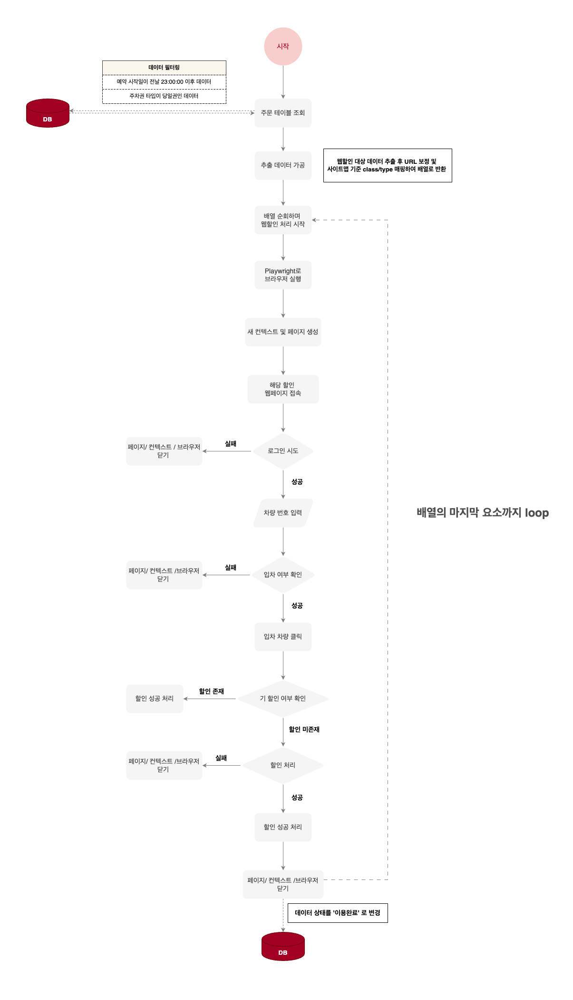

# 웹할인 자동화 시스템 (Web Discount Automation)

> **웹할인 자동화 시스템**은 주차권을 결제한 사용자에 대해 각 파트너사의 웹페이지에 자동으로 접속해 주차 할인을  수행하는 **RPA(Robotic Process Automation)** 시스템 입니다.  
> 반복적인 수작업을 자동화하여 <u>운영 리소스를 절감하고 할인 누락으로 인한 고객 민원 및 불편을 방지합니다.</u>

💡 운영 환경에서 실사용되었던 구조를 기반으로 재구성 되었으며 **외부 시스템 연동 및 실행 데모는 제공되지 않습니다.**  
구조와 흐름, 로직의 이해를 위한 참고용으로 활용해주세요!




## 설계 구조 및 운영 효과  
- 다양한 파트너사 웹 구조 대응을 위한 **class/type 기반 분기 처리 구조**
- **Playwright 기반 RPA 자동화**로 반복 작업 최소화 및 안정성 확보
- 장애 발생 시 자동 이메일 발송으로 **즉각적인 대응 및 복구 체계 마련**
- **모듈화된 디렉토리 구조**로 새로운 제휴처 대응 시 빠른 기능 확장 가능

## 개요

- **5분 간격으로 실행되는 스케줄러가 DB 내 할인 대상 주문을 조회**하고
- **Playwright로 웹 브라우저를 제어하여 로그인 → 차량 조회 → 할인 적용을 수행**
  - 성공 시: DB 상태를 ```FINISHED```로 갱신
  - 실패 시(장애 발생 시): **차량번호, 주차장명, 할인 사이트, 에러 메시지를 포함한 장애 알림 이메일** 자동 발송

## 기술 스택

| 구분           | 기술                        | 설명                                   |
| ------------- | -----------------------    | ----------------------------------   |
| 언어           | TypeScript                  |                                      | 
| 자동화          | Playwright               | 브라우저 제어 기반 RPA                     |
| DB            | MySQL                    | 운영 데이터 조회 및 상태 갱신                  |
| 스케줄러        |	node-cron                | 5분 간격 배치 실행                           |
| 운영환경        |	NHN Cloud 서버 + PM2      | 무중단 배포 및 운영                             |
| 로깅/모니터링    | winston, nodemailer      | 일별 로그 파일 관리 + 장애 시 이메일 전송으로 모니터링 |

## 디렉토리 구조

```js
src/
├── config/
│   └── db/                   // DB 연결 및 파트너사 사이트맵
│   └── siteMap.ts            // 파트너사 주차장 할인 웹사이트 매핑
├── interface/
│   └── order.ts              // 주문 데이터 인터페이스
│   └── site.ts               // 사이트맵 인터페이스
├── scheduler/
│   └── discountJob.ts        // 주문 조회 및 할인처리 루프
│   └── processDiscount.ts    // class/type 기반 자동화 분기
├── service/                  // 파트너사별 자동화 처리
│   └── class/
│       ├── class0/
│       │   ├── index.ts      // type 분기 처리 
│       │   └── type/
│       │       ├── type0.ts
│       │       ├── type1.ts   // 각 웹페이지별 할인 처리 로직
│       │       └── ...
│       ├── class1/
│       │   ├── index.ts 
│       │   └── type/
│       │       ├── type0.ts  
│       │       └── ...
│       └── ...
├── utils/
│   └── logger.ts               // winston 기반 로그 관리
│   └── sendEmailAlert.ts       // 장애 발생 시 이메일 발송
│   └── waitStablePage.ts       // 브라우저 안정화 대기
└── index.ts                    // 엔트리 포인트 (크론 스케줄러 등록)

```

## 전체 흐름 요약

#### 1.스케줄러 등록 (index.ts)

```ts
import cron from 'node-cron';
cron.schedule('*/5 * * * *', handleDiscountJob); // 5분마다 실행
```

#### 2. 할인 대상 주문 조회 (discountJob.ts)

- ```discountJob.ts``` 내 ```query()```를 통해 할인 대상 주문 추출
- 필터 조건
  - 결제 상태: ```PAID```, ```REQUEST_DISCOUNT```
  - 주차권 타입: ```FIXED```
  - 웹할인 URL 및 로그인 정보
  - 예약 시작일이 전날 23:00:00 이후 데이터
- 주문 데이터의 apiURL과 siteMap의 URL을 비교해, 해당 주문에 맞는 class와 type 정보를 할당하고 자동화 처리 대상만 필터링

```ts
  const enriched = orders.map(order => {
    const matched = siteMap.find(site => order.apiURL.includes(site.url.replace(/^https?:\/\//, '')));
    if (matched) {
      return { ...order, ...matched };
    }
    return order;
  }).filter(order => order.class !== undefined);
```

#### 3. 할인 처리 (processDiscount.ts)

- class 값에 따라 해당 파트너사 디렉토리로 분기
- 내부에서 type 값으로 할인 로직 분기

```ts
switch (order.class) {
  case 0: return await class0(order);
  case 1: return await class1(order);
  ...
}
```

#### 4. Playwright 기반 할인 자동화 (type0.ts) - 예시


```ts
  try {
    // 1. 파트너사 웹페이지 접속
    await page.goto(order.apiURL, { waitUntil: 'networkidle' });

    // 2. 로그인 정보 입력 및 로그인 시도
    await page.fill('#login_id', order.apiUsername); // 아이디 입력
    await page.fill('#login_pw', order.apiPassword); // 비밀번호 입력
    await page.click('button:has-text("로그인")'); // 로그인 버튼 클릭

    // 3. 차량번호 뒷자리 기준 검색 및 입차 차량 여부 확인

    // 4. 기 할인 여부 중복 체크

    // 5. 상품명 기반 할인 항목 선택

    // 6. 할인 적용 버튼 클릭 → 성공 시 true 반환
    return true;

  } catch (err: any) {
    // 예외 발생 시 에러 메시지 포함하여 throw
    throw new Error(`[ERROR] ${order.parkName} (${order.carNum}): ${err.message}`);
  }
```

**성공 시**

- DB 상태를 ```FINISHED```로 갱신 및  성공 여부 로그 기록

```ts
if (success) {
  await query(`
    UPDATE tbl_order SET 
      status = 'FINISHED',
      modified_by = 'SYSTEM'
    WHERE id = ?
  `, [order.orderID]);

  log.info(`[완료] ${order.parkName} (${order.carNum}) 할인 적용 완료`);
} 
```

> ❗ 입차 기록이 없는 경우는 시스템 오류가 아닌 아직 입차가 완료되지 않은 정상적인 상황이기 때문에 해당 주문은 DB 상태를 변경하지 않고, **다음 스케줄링 시 재시도 대상**으로 유지


---


#### 5. 실패 처리 및 메일 전송
할인 처리 도중 예상치 못한 오류가 발생하거나 웹페이지 구조가 변경되어 정상 처리가 불가능한 경우에는 다음 방식으로 대응

- 오류 발생 시 ```sendEmailAlert()``` 함수 호출
- 사전에 설정된 수신자 메일로 **자동 장애 알림 메일 전송**
- 오류와 관련된 **주문 정보 + 상세 에러 메시지** 포함

```ts
catch (err) {
      const message = err instanceof Error ? err.message : String(err);

      await sendEmailAlert(order, message);
      log.error(`[error] ${order.parkName} (${order.carNum}) 처리 중 오류: ${message}`)
}
```

> ❗ 예외 발생 시 담당자에게 실시간 알림 메일이 전송되어 **빠르게 원인을 파악하고 수동 할인 처리 또는 시스템 수정을 가능하도록 구성**


